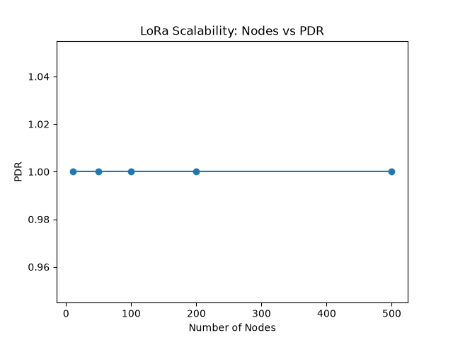
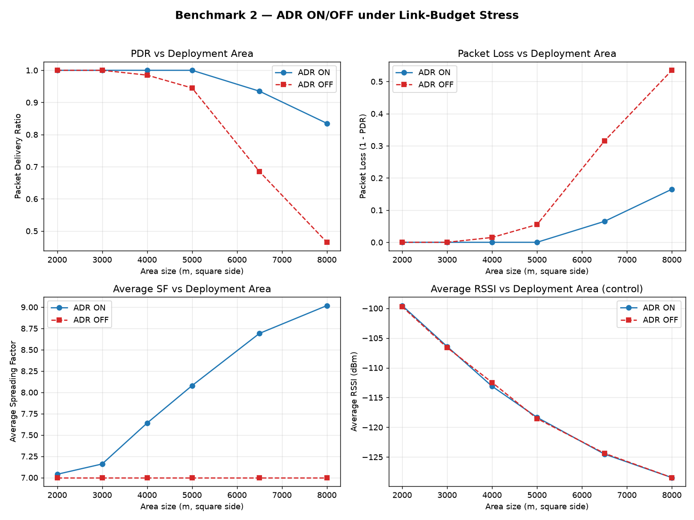
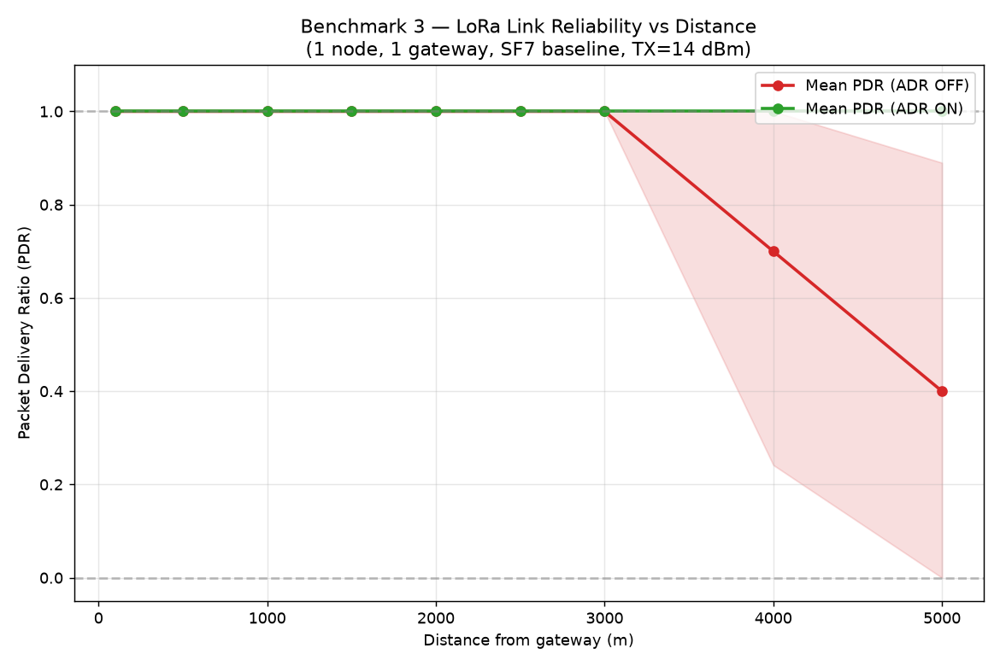

# LoRa IoT Simulator


[](https://github.com/Dlyar-buxi/LoRa-IoT-Simulator/releases)

A full-stack LoRa LPWAN network simulation & monitoring platform — from embedded
sensor nodes, through LoRa PHY/MAC and gateways, all the way to a live Web
dashboard with MQTT telemetry export and SQLite experiment persistence.

> The simulation core (`simulator/`, `gateway/`) is **frozen** since Sprint 4.
> The backend is a pure **Adapter** layer: the simulation core never imports any
> backend or frontend code, and has zero knowledge of MQTT, WebSocket, or SQLite.

## Dashboard Preview


## Research Benchmark

This project ships a **reproducible benchmark suite** (Sprint 6.1) that turns the
simulator from "a tool that runs" into "a platform you can study". Three experiments
evaluate network **scalability**, **ADR performance**, and **link reliability** under
controlled, parameterized conditions — all driven by the frozen simulation core through
the read-only `backend.engine.SimulationEngine` harness, with **zero changes** to
`simulator/`.

> All figures below are generated by `python scripts/run_all_benchmarks.py` and live in
> `docs/benchmark/` (CSV data + PNG). See
> [`docs/benchmark/README.md`](docs/benchmark/README.md) for the full methodology and
> conclusions.

### 1. Scalability Evaluation

How does the network behave as the node population grows?

- **Nodes:** 10 → 500
- **Setup:** 2000 m × 2000 m area, 2 gateways, ADR on, seed 42
- **Metrics:** Packet Delivery Ratio (PDR), Throughput, Average RSSI/SF, Collision rate

PDR stays at **100%** across the whole sweep (the frozen PHY model recovers most
collisions via retransmission), while **throughput scales linearly** from 0.1 → 5.0
pkt/s — confirming the engine is not the bottleneck at this scale.



### 2. ADR Performance

Does Adaptive Data Rate actually help? We sweep the deployment area (2000 m → 8000 m) at
fixed node count and compare **ADR enabled** vs **ADR disabled**.

- **Metrics:** Packet Delivery Ratio, Packet Loss, Average SF, Collision rate
- **Finding:** ADR is inert under strong links (SF7 already satisfies the budget), but in
  large-scale deployments it lifts PDR dramatically — e.g. at 8000 m, PDR rises from
  **0.46 → 0.77**. Higher SF rescues weak links via LoRa processing gain and
  orthogonalizes them against the SF7 crowd, cutting collisions.



### 3. Distance Reliability

A single-node link-budget experiment: one node placed at precise distances (100 m → 5000 m)
from one gateway.

- **Metrics:** PDR vs distance, with / without ADR
- **Finding:** With a fixed SF7, reliability holds at 100% up to ~3 km, then collapses over
  the sensitivity cliff (**0.70 @ 4 km, 0.40 @ 5 km**). With **ADR on**, PDR stays at 100%
  across the entire 100 m → 5000 m range — a minimal, clean demonstration of ADR's
  link-budget rescue.



## Reproduce Benchmark

Run the entire suite (all three experiments + figures) with a single command:

```bash
python scripts/run_all_benchmarks.py
```

Results are written to `docs/benchmark/` and can be regenerated at any time.

## Features

- **Discrete-event LoRa simulation** — heap-based event scheduler (`heapq` DES).
- **LoRa PHY model** — log-distance path loss, shadow fading, RSSI/SNR, collision detection.
- **LoRa MAC** — pure ALOHA, retransmission with random backoff, **ADR** adaptive data rate.
- **Multi-gateway selection** — each node attaches to the gateway with the best RSSI.
- **FastAPI backend as Adapter** — wraps the frozen engine, exposes REST + WebSocket.
- **Real-time Dashboard** — vanilla JS + SVG: topology, PDR/RSSI curves, packet table (no external chart libs).
- **WebSocket telemetry** — every simulation event is pushed live to the browser.
- **MQTT telemetry export** — optional publish to `lora/device/data` (broker down = silent drop).
- **SQLite experiment persistence** — full topology + per-event telemetry recorded; replay & A/B compare.
- **Parameterized experiment platform** — inject node count / area / gateway placement / seed / ADR at runtime via REST.
- **Resilient by design** — MQTT, SQLite and WebSocket failures degrade silently; nothing crashes the sim.
- **Hermetic test suite** — 14/14 regression across backend + simulator + gateway; frozen-core diff always empty.
- **One-command automation** — headless experiment generation + Markdown report (`scripts/`), no web server required.

## Architecture

```
        FastAPI Backend (backend/)
                  |
        SimulationEngine  <-- Adapter layer (backend/engine.py)
                  |
        Simulator Core (Frozen: simulator/)
                  |
     +------------+------------+
     |            |            |
   MQTT       WebSocket      SQLite
 Telemetry    Dashboard      Recorder
(lora/       (/ws, live)   (experiments.db)
 device/
 data)
```

- **`simulator/`** — Core simulation layer (nodes, sensor, channel, MAC, energy, ADR). **Frozen.**
- **`gateway/`** — LoRa gateway / network layer. **Frozen.**
- **`backend/`** — Adapter layer: FastAPI app, REST + WS, telemetry sink, SQLite recorder, MQTT client.

### Data flow

```
simulator/simulation.py
   └─> SimulationEngine.step()
          └─> telemetry_sink(record)        # a single injected callable
                 ├─> MQTT  publish lora/device/data   (optional, silent degrade)
                 ├─> WS    broadcast to /ws clients    (live dashboard)
                 └─> SQLite recorder.record_event()    (optional, silent degrade)
          └─> get_*()  ->  REST /api/* + WS  ->  frontend rendering
```

### Frozen-core & Adapter boundary

- `simulator/` and `gateway/` are byte-level frozen since Sprint 4 (across Sprints 4.4 → 5.3).
- The backend never edits simulation code; it injects a `telemetry_sink` and a
  `configure()` entry point (runtime ADR binding via `config.ADR_ENABLED`).
- The simulation core has **zero knowledge** of MQTT, WebSocket, or SQLite — it only
  calls the injected sink during `step()`.

## ChannelModel Architecture (v6.4)

> Frozen in Sprint 6.4 and tagged **`v6.4-channel-model`**. The channel subsystem was refactored from a legacy single-file propagation stack (removed in 5.2.2) into a pluggable `ChannelModel` API. Design rationale: [`docs/design/channel-presentation-v1.md`](docs/design/channel-presentation-v1.md).

### Overview

**Why refactor.** The legacy stack scattered the physics (Friis / log-distance / shadowing / Rayleigh) across `propagation.py` / `channel.py` / `shadowing_channel.py`, with implicit coupling and no single source of truth for parameters. Consumers read channel fields straight off `Packet`, blurring the model-output / simulation-entity boundary.

**What changed.** A unified `ChannelModel` interface — `evaluate(context: TransmissionContext) -> ChannelResult` — lets all three models share one output contract. `ChannelResult` is now the **retained, self-describing** carrier of a single link's physical outcome (it carries `distance` / `path_loss` and is kept alive as `packet.channel_result` by the adapter). A zero-intrusion `LinkBudget` layer decomposes that result into an interpretable link budget without touching any physics.

**Benefits.**
- **Unified contract** — three models, one `ChannelResult`; consumers stop caring which model ran.
- **Full lifecycle** — `ChannelResult` survives the adapter call as a `packet.channel_result` handle.
- **Interpretable** — `LinkBudget` makes `Tx → PathLoss → (Shadowing | Fading) → ReceivedPower → Noise → SNR → PDR` explicit.
- **Clean config boundary** — `config.py` is the single parameter source; the model layer has **zero** `config` imports.

### Architecture

```
config.py  (single source of truth)
        │
        ▼
TransmissionContext
        │
        ▼
ChannelModel  (evaluate(context) -> ChannelResult)
        ├── LogDistanceChannel
        ├── ShadowingChannel
        └── RayleighChannel
                │
                ▼
         ChannelResult  (rssi / snr / pdr / distance / path_loss)
                │
                ▼
            LinkBudget  (decompose, read-only)
                │
                ▼
            Simulation / consumers
```

Three hard boundaries (frozen across 6.4):
- `ChannelModel` is the **output contract** — consumers depend on `ChannelResult`, never on a model's internals.
- `LinkBudget` is an **interpretation layer only** — it decomposes a result; it never changes `rssi` / `snr` / `pdr` or any random process. Invariant: `received_power = tx_power − path_loss + shadowing_loss + fading_gain`.
- `config` is the **single parameter source** — parameters flow one way `config → TransmissionContext → ChannelModel`; the model layer never imports `config`.

### Channel Models

| Model | Path Loss | Shadowing (large-scale) | Small-scale Fading |
| --- | --- | --- | --- |
| `LogDistanceChannel` | ✓ | — | — |
| `ShadowingChannel` | ✓ | Gaussian (σ = `config.SHADOW_SIGMA` = 4.0) | — |
| `RayleighChannel` | ✓ | — | Rayleigh (`h ~ CN(0,1)`, `E[|h|²] = 1`) |

All three share the common chain `tx_power → path_loss → received_power → noise_floor → snr → pdr`. Model-specific extras: `ShadowingChannel` adds `shadowing_loss` (Gaussian); `RayleighChannel` adds `fading_gain` (small-scale, `E[fading_gain] ≈ 1`); `LogDistanceChannel` adds neither.

**Configuration ownership.** Every wireless parameter is injected via constructor argument or `TransmissionContext` — the model layer imports **no** `config`. Internal defaults (e.g. `ShadowingChannel(sigma=7.0)`) exist only as fallbacks; callers must explicitly pass the config value (`config.SHADOW_SIGMA`). See [`docs/design/channel-config-v1.md`](docs/design/channel-config-v1.md).

### Link Budget Decomposition

`LinkBudget` is a pure, read-only decomposition of an already-computed `ChannelResult` — it introduces no new physics and no new packet API. Public API:

```python
from simulator.channel_model import ChannelModel, TransmissionContext, ChannelResult
from simulator.channel_model.link_budget import decompose, LinkBudgetResult

# `channel` is any ChannelModel (LogDistance / Shadowing / Rayleigh)
# `context` is the TransmissionContext the model was evaluated against
result: ChannelResult = channel.evaluate(context)
budget: LinkBudgetResult = decompose(channel, context)
# budget.received_power == result.rssi  (invariant, within float tolerance)
```

`LinkBudgetResult` exposes `tx_power`, `path_loss`, `shadowing_loss`, `fading_gain`, `received_power`, `noise_power`, `snr` — the interpretable intermediate states of one link, ready for charts or Monte-Carlo summaries. See [`docs/design/link-budget-v1.md`](docs/design/link-budget-v1.md).

### Validation

The channel subsystem is locked by a focused, flaky-resistant test suite:

```bash
pytest -q simulator
```

```
41 passed
```

Eight validation dimensions, all green:

| Dimension | Evidence |
| --- | --- |
| `ChannelResult` lifecycle (retained as `packet.channel_result`) | `test_channel_model.py`, `test_rayleigh_channel.py`, `test_channel_model_validation.py` |
| `distance` / `path_loss` self-describing | `test_channel_result_statistics.py::test_distance_propagates_to_result` |
| `path_loss` strictly monotonic in distance | `test_channel_result_statistics.py::test_log_distance_path_loss_monotonic` |
| Shadowing σ converges ≈ `config.SHADOW_SIGMA` | `test_channel_result_statistics.py::test_shadowing_sigma_statistics` |
| Rayleigh `E[|h|²] ≈ 1` (via public `ChannelResult` only) | `test_channel_result_statistics.py::test_rayleigh_power_statistics` |
| LinkBudget invariant `received_power = tx_power − path_loss + shadowing_loss + fading_gain` | `test_link_budget.py::test_core_invariant_holds_for_all_models` |
| Adapter backward compatibility (`packet.channel_result.rssi == packet.rssi`) | `test_channel_result_statistics.py::test_adapter_backward_compatibility` |
| Config ownership decoupling (zero model-layer `config` dependency) | `test_channel_config_ownership.py` (5 tests) |

### Release

This architecture is frozen and tagged:

```
Release: v6.4-channel-model  →  fe08285
```

Design freeze documents: [`channel-presentation-v1.md`](docs/design/channel-presentation-v1.md), [`link-budget-v1.md`](docs/design/link-budget-v1.md), [`channel-config-v1.md`](docs/design/channel-config-v1.md), [`channel-architecture-v1.md`](docs/design/channel-architecture-v1.md).

## Quick Demo

The fastest way to see the simulator running **with sample data** — no code edits, no manual configuration.

### Option 1: Docker Demo (recommended)

Clone and start the full stack with a pre-seeded demo LoRa network:

```bash
git clone https://github.com/Dlyar-buxi/LoRa-IoT-Simulator.git
cd LoRa-IoT-Simulator
docker compose --profile demo up --build
```

Then open the dashboard:

```
http://localhost:8000
```

This single command:
- starts the FastAPI backend and the MQTT broker,
- generates a demo network (20 nodes, 2 gateways, 400 m × 400 m area, seed 1),
- writes the sample experiment into the shared `experiments-db` volume,
- populates the dashboard with live, ready-to-explore data.

### Option 2: Local Python Demo

No Docker? Generate the same demo headlessly:

```bash
python -m pip install -r requirements.txt
python scripts/run_demo.py
```

Two artifacts are written next to the repo:

```
demo.db          # SQLite experiment (20 nodes, 2 gateways, area 400, seed 1)
demo_report.md   # Markdown summary: PDR / throughput / SF distribution
```

The `demo_report.md` is a standalone summary — open it directly, no server needed.
To explore the data live in the dashboard, start the backend:

```bash
uvicorn backend.main:app --reload
# open http://127.0.0.1:8000/
```

> The dashboard reads the default `experiments.db`. To view the demo you just
> generated instead, set `DB_PATH=demo.db` (Linux/macOS) or
> `$env:DB_PATH="demo.db"` (PowerShell) before the `uvicorn` command above.

### Demo vs Production

| | Command | What you get |
|---|---|---|
| **Production** | `docker compose up --build` | Backend + broker only; you configure and start runs from the dashboard. No sample data. |
| **Demo** | `docker compose --profile demo up --build` | Same stack, plus a one-shot `demo-init` service that seeds a sample experiment on first launch. |

The demo is **opt-in** via the `demo` Docker Compose profile. By default
`docker compose up --build` stays clean — your environment is never populated with
demo artifacts unless you explicitly add `--profile demo`.

- In Docker, `demo-init` runs **once** (no restart), writes into the same
  `experiments-db` volume the backend reads, then exits. The seed data lives only
  in that volume — it is never committed to the repository and is wiped with
  `docker compose down -v`.
- Locally, `run_demo.py` writes `demo.db` (git-ignored), **not** the default
  `experiments.db`, so your production database file is never touched.

> Want to customize or regenerate the demo? See
> [Automated Demo](#automated-demo-sprint-60) for `generate_experiment.py`
> options and report export.

## Quick Start

Requirements: Python 3.12+

```bash
cd LoRa-IoT-Simulator
python -m venv venv
source venv/Scripts/activate        # Windows: venv\Scripts\activate
pip install -r requirements.txt
uvicorn backend.main:app --reload
```

Open the dashboard:

```
http://127.0.0.1:8000/
```

> **Note:** `python simulator/main.py` is the standalone Step-1 demo that prints
> 200 sample nodes to the console. It is **not** the web platform. Use `uvicorn`
> for the full dashboard + API experience.

Default experiment: **200 nodes, 2 gateways, 2000 m × 2000 m area, ADR enabled, seed 42**
(868 MHz, 125 kHz bandwidth, SF 7 default).

## Dashboard Demo

The dashboard (`frontend/`, served at `/`) provides:

- **Control bar** — Start / Pause / Step / Reset / Auto-run toggle.
- **KPI cards** — PDR, Throughput, Received, Lost, Simulation Time, Pending.
- **Grids** — node topology (SVG), PDR, SF distribution, RSSI map.
- **Packet table** — recent events streamed over WebSocket.

Press **Start** (or **Step**) and watch the topology and curves update in real time.

### Experiment Configuration Panel (Sprint 5.5)

The dashboard includes a configuration panel (top of the page) that lets you set
the next experiment without touching code or curl:

- **Nodes** (`node_count`) — number of sensor nodes.
- **Area size** (`area_size`) — square field side in meters.
- **Seed** (`seed`) — RNG seed for reproducible topologies.
- **Duration** (`duration`) — simulation horizon in seconds.
- **Gateways** (`gateway_count`, 1–4) — gateways are auto-placed and color-coded on the topology.
- **ADR enabled** (`adr_enabled`) — adaptive data rate toggle.

Press **Apply** to commit the configuration; this stops any auto-run and the UI
prompts you to press **Start**. Invalid input (e.g. 0 nodes) is reported inline
in the panel. The current configuration is pre-filled from `GET /api/simulation/config`.

## Experiment Platform (Sprint 5.3)

Configure the next simulation run at runtime — no code changes, fully reproducible.

```bash
curl -X POST http://127.0.0.1:8000/api/simulation/config \
  -H "Content-Type: application/json" \
  -d '{
    "node_count": 100,
    "area_size": 2000,
    "seed": 42,
    "duration": 120,
    "adr_enabled": true
  }'
```

Read the active config:

```bash
curl http://127.0.0.1:8000/api/simulation/config
```

All fields are optional (omitted ones keep their current value). Validation returns
`400` for: `node_count <= 0`, an empty gateway list, duplicate gateway ids, or
gateway coordinates outside the area.

## MQTT Integration (Sprint 5.1)

Every telemetry record is published to `lora/device/data` (QoS 0). The broker is
**optional** — if it is unreachable the publish silently fails and the simulation
continues unaffected.

Configure via environment variable:

```
MQTT_BROKER_URL=mqtt://localhost:1883
```

See `examples/mqtt_subscribe.md` for a subscriber snippet.

## SQLite Persistence (Sprint 5.2)

Each simulation run is recorded as one experiment (`experiments` row) plus its
per-event telemetry (`events` rows). Experiments are kept across resets — a reset
starts a **new** experiment and never overwrites history.

```bash
curl http://127.0.0.1:8000/api/experiments          # list experiments
curl http://127.0.0.1:8000/api/experiments/1        # detail + events (replay/compare)
```

Configure via environment variables:

```
DB_ENABLED=true
DB_PATH=experiments.db
```

If the DB is unavailable, recording degrades silently and the API returns an empty list.

## Automated Demo (Sprint 6.0)

Headless scripts in `scripts/` run a full simulation and export a report
**without starting the web server** — ideal for CI, batch runs, and Docker.

```bash
# One-command local demo: generates demo.db and demo_report.md
python scripts/run_demo.py

# Run a custom headless experiment (records to a SQLite file)
python scripts/generate_experiment.py \
    --nodes 50 --area 1000 --seed 7 --duration 120 --gateways 3 --adr --db run.db

# Export the latest (or a specific --id) experiment to Markdown
python scripts/export_report.py --db run.db --out run_report.md
```

These scripts import only `backend.engine` and `backend.database`; they never
launch uvicorn, WebSocket, or MQTT. `Packet Loss Rate` in the report is derived
as `1 - PDR` (the frozen PHY model does not expose a separate collision counter).

## API Reference

Base URL: `http://127.0.0.1:8000`  •  Prefix: `/api`  •  Full detail: [`docs/api.md`](docs/api.md)

### Simulation Control
| Method | Endpoint | Description |
|--------|----------|-------------|
| POST | `/api/simulation/start` | Begin running (pull model). |
| POST | `/api/simulation/pause` | Pause, keep state. |
| POST | `/api/simulation/step?steps=N` | Advance N discrete events (default 1). |
| POST | `/api/simulation/stop` | Halt advancing, keep state. |
| POST | `/api/simulation/reset` | Rebuild with same seed, back to t=0. |

### Configuration
| Method | Endpoint | Description |
|--------|----------|-------------|
| GET | `/api/simulation/config` | Current active config. |
| POST | `/api/simulation/config` | Inject topology params (400 on invalid). |

### Data
| Method | Endpoint | Description |
|--------|----------|-------------|
| GET | `/api/nodes` | Node snapshots (SF, RSSI/SNR, gateway, battery). |
| GET | `/api/gateways` | Gateway statistics. |
| GET | `/api/statistics` | Network PDR / throughput / retries. |
| GET | `/api/history?bucket=1` | Time-bucketed link timeline. |
| GET | `/api/packets?limit=N` | Event-level packet history. |
| GET | `/api/export/json` | Combined status/nodes/gateways/stats/packets/history. |

### Experiment
| Method | Endpoint | Description |
|--------|----------|-------------|
| GET | `/api/experiments` | List persisted experiments. |
| GET | `/api/experiments/{id}` | Detail + full events (404 if missing). |

### Realtime
- **WebSocket** — connect to `ws://127.0.0.1:8000/ws` to receive every telemetry record as JSON text.
- **MQTT** — subscribe to topic `lora/device/data`.

## Testing

```bash
pip install -r requirements.txt
pip install pytest
python -m pytest backend/ simulator/ gateway/ -q
```

Hermetic tests use `tempfile` / `:memory:` / `DB_ENABLED=false` — they never
pollute the project directory. Regression target: **14/14** (backend + simulator
+ gateway; no live MQTT broker required). A GitHub Actions workflow
(`.github/workflows/test.yml`) runs this suite on every push and PR.

## Benchmarks

The headline, figure-driven evaluation suite is documented in
[**Research Benchmark**](#research-benchmark) above — Scalability, ADR Performance, and
Distance Reliability, all reproducible via `python scripts/run_all_benchmarks.py`. The
lower-level single-run harness (`scripts/generate_experiment.py`) is covered under
[Automated Demo](#automated-demo-sprint-60).

## Project Structure

```
LoRa-IoT-Simulator/
├── simulator/        # Frozen core: nodes, sensor, channel, MAC, energy, ADR
├── gateway/          # Frozen LoRa gateway / network layer
├── backend/          # FastAPI Adapter: engine, routes, mqtt_client, database, tests
├── frontend/         # Web dashboard (vanilla JS + SVG)
├── docs/
│   ├── benchmark/          # benchmark datasets and figures
│   ├── releases/           # release notes (v1.1.0.md)
│   ├── reproducibility.md  # reproduction guide
│   ├── portfolio.md        # portfolio summary
│   ├── architecture.md
│   └── api.md
├── examples/         # curl scripts & MQTT subscriber guide
├── screenshots/      # demo captures
├── scripts/          # headless CLI: generate_experiment.py, export_report.py, run_demo.py
├── .github/          # workflows (CI) + issue/PR templates
├── Dockerfile        # backend image (python:3.12-slim)
├── .dockerignore
├── docker-compose.yml
├── .env.example
├── LICENSE           # MIT
├── CONTRIBUTING.md
├── CHANGELOG.md
└── README.md
```

## Release v1.0

The project is tagged **`v1.0.0`** (RC v5.5 baseline). Highlights:

- **MIT licensed** — free to use, modify, and redistribute.
- **Frozen simulation core** — `simulator/` and `gateway/` are byte-level unchanged
  since Sprint 4; the backend is a pure Adapter over them.
- **Full open-source kit** — Docker image + Compose, headless scripts, CI, issue/PR
  templates, and this documentation.
- **No GitHub Release API is invoked** by the tooling; `git tag v1.0.0` is created
  manually after the freeze commit.

Get it:

```bash
git clone https://github.com/Dlyar-buxi/LoRa-IoT-Simulator.git
cd LoRa-IoT-Simulator
docker compose up --build      # full stack with one command
```

## Roadmap

| Sprint | Status | Content |
|--------|--------|---------|
| 1–3 | done | Skeleton, LoRa PHY/channel, MAC, collision, gateway |
| 4.4 | done | Visualization platform (Dashboard) |
| 5.1 | done | MQTT realtime telemetry |
| 5.2 | done | SQLite experiment persistence |
| 5.3 | done | Parameterized experiment platform |
| 5.4 | done | Project packaging (README, docs, examples, docker, screenshots) |
| 5.5 | done | Dashboard Experiment Config Panel (frontend) |
| 6.0 | done | Open-source release hardening (MIT, Docker, scripts, CI, docs) |
| 6.1 | done | Benchmark Research Suite (scalability, ADR, distance) |
| 6.2 | done | Demo pipeline, benchmark reproducibility, v1.1.0 release |
| 6.3 | in progress | Portfolio refinement and interview preparation |

## Resume Highlights

1. **End-to-end IoT full-stack** — embedded node → LoRa PHY/MAC → gateway → MQTT → FastAPI → Web.
2. **Self-built LoRa PHY+MAC simulation** — path loss, ALOHA collision, ADR, multi-gateway RSSI selection.
3. **Three-exit telemetry sink** — WebSocket + MQTT + SQLite from a single injected callable.
4. **Experiment persistence & replay** for A/B comparison of network configurations.
5. **Parameterized, reproducible experiments** via REST — no code changes to re-run a scenario.
6. **Clean Adapter architecture** with a frozen simulation core (zero reverse dependency).
7. **Resilient design** — every external sink degrades silently; no single point of failure.
8. **Test discipline** — hermetic pytest, 14/14 regression, frozen-core diff always empty.
9. **Minimal runtime dependencies** — only `fastapi`, `uvicorn`, `paho-mqtt`.
