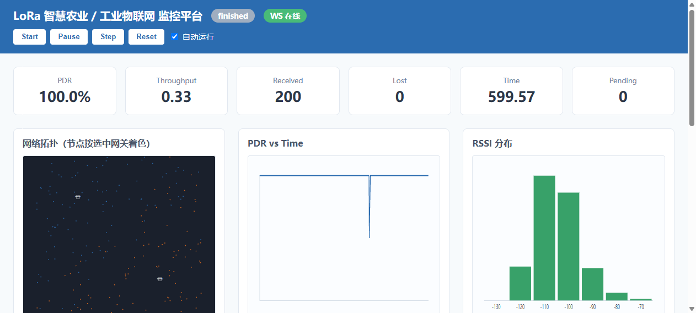

# LoRa IoT Simulator


A full-stack LoRa LPWAN network simulation & monitoring platform — from embedded
sensor nodes, through LoRa PHY/MAC and gateways, all the way to a live Web
dashboard with MQTT telemetry export and SQLite experiment persistence.

> The simulation core (`simulator/`, `gateway/`) is **frozen** since Sprint 4.
> The backend is a pure **Adapter** layer: the simulation core never imports any
> backend or frontend code, and has zero knowledge of MQTT, WebSocket, or SQLite.

## Dashboard Preview



## Features

- **Discrete-event LoRa simulation** — heap-based event scheduler (`heapq` DES).
- **LoRa PHY model** — log-distance path loss, shadow fading, RSSI/SNR, collision detection.
- **LoRa MAC** — pure ALOHA, retransmission with random backoff, **ADR** adaptive data rate.
- **Multi-gateway selection** — each node attaches to the gateway with the best RSSI.
- **FastAPI backend as Adapter** — wraps the frozen engine, exposes REST + WebSocket.
- **Real-time Dashboard** — vanilla JS + SVG: topology, PDR/RSSI curves, packet table (no external chart libs).
- **WebSocket telemetry** — every simulation event is pushed live to the browser.
- **MQTT telemetry export** — optional publish to `lora/device/data` (broker down = silent drop).
- **SQLite experiment persistence** — full topology + per-event telemetry recorded; replay & A/B compare.
- **Parameterized experiment platform** — inject node count / area / gateway placement / seed / ADR at runtime via REST.
- **Resilient by design** — MQTT, SQLite and WebSocket failures degrade silently; nothing crashes the sim.
- **Hermetic test suite** — 14/14 regression across backend + simulator + gateway; frozen-core diff always empty.
- **One-command automation** — headless experiment generation + Markdown report (`scripts/`), no web server required.

## Architecture

```
        FastAPI Backend (backend/)
                  |
        SimulationEngine  <-- Adapter layer (backend/engine.py)
                  |
        Simulator Core (Frozen: simulator/)
                  |
     +------------+------------+
     |            |            |
   MQTT       WebSocket      SQLite
 Telemetry    Dashboard      Recorder
(lora/       (/ws, live)   (experiments.db)
 device/
 data)
```

- **`simulator/`** — Core simulation layer (nodes, sensor, channel, MAC, energy, ADR). **Frozen.**
- **`gateway/`** — LoRa gateway / network layer. **Frozen.**
- **`backend/`** — Adapter layer: FastAPI app, REST + WS, telemetry sink, SQLite recorder, MQTT client.

### Data flow

```
simulator/simulation.py
   └─> SimulationEngine.step()
          └─> telemetry_sink(record)        # a single injected callable
                 ├─> MQTT  publish lora/device/data   (optional, silent degrade)
                 ├─> WS    broadcast to /ws clients    (live dashboard)
                 └─> SQLite recorder.record_event()    (optional, silent degrade)
          └─> get_*()  ->  REST /api/* + WS  ->  frontend rendering
```

### Frozen-core & Adapter boundary

- `simulator/` and `gateway/` are byte-level frozen since Sprint 4 (across Sprints 4.4 → 5.3).
- The backend never edits simulation code; it injects a `telemetry_sink` and a
  `configure()` entry point (runtime ADR binding via `config.ADR_ENABLED`).
- The simulation core has **zero knowledge** of MQTT, WebSocket, or SQLite — it only
  calls the injected sink during `step()`.

## Quick Start

Requirements: Python 3.12+

```bash
cd LoRa-IoT-Simulator
python -m venv venv
source venv/Scripts/activate        # Windows: venv\Scripts\activate
pip install -r requirements.txt
uvicorn backend.main:app --reload
```

Open the dashboard:

```
http://127.0.0.1:8000/
```

> **Note:** `python simulator/main.py` is the standalone Step-1 demo that prints
> 200 sample nodes to the console. It is **not** the web platform. Use `uvicorn`
> for the full dashboard + API experience.

Default experiment: **200 nodes, 2 gateways, 2000 m × 2000 m area, ADR enabled, seed 42**
(868 MHz, 125 kHz bandwidth, SF 7 default).

## Dashboard Demo

The dashboard (`frontend/`, served at `/`) provides:

- **Control bar** — Start / Pause / Step / Reset / Auto-run toggle.
- **KPI cards** — PDR, Throughput, Received, Lost, Simulation Time, Pending.
- **Grids** — node topology (SVG), PDR, SF distribution, RSSI map.
- **Packet table** — recent events streamed over WebSocket.

Press **Start** (or **Step**) and watch the topology and curves update in real time.

### Experiment Configuration Panel (Sprint 5.5)

The dashboard includes a configuration panel (top of the page) that lets you set
the next experiment without touching code or curl:

- **Nodes** (`node_count`) — number of sensor nodes.
- **Area size** (`area_size`) — square field side in meters.
- **Seed** (`seed`) — RNG seed for reproducible topologies.
- **Duration** (`duration`) — simulation horizon in seconds.
- **Gateways** (`gateway_count`, 1–4) — gateways are auto-placed and color-coded on the topology.
- **ADR enabled** (`adr_enabled`) — adaptive data rate toggle.

Press **Apply** to commit the configuration; this stops any auto-run and the UI
prompts you to press **Start**. Invalid input (e.g. 0 nodes) is reported inline
in the panel. The current configuration is pre-filled from `GET /api/simulation/config`.

## Experiment Platform (Sprint 5.3)

Configure the next simulation run at runtime — no code changes, fully reproducible.

```bash
curl -X POST http://127.0.0.1:8000/api/simulation/config \
  -H "Content-Type: application/json" \
  -d '{
    "node_count": 100,
    "area_size": 2000,
    "seed": 42,
    "duration": 120,
    "adr_enabled": true
  }'
```

Read the active config:

```bash
curl http://127.0.0.1:8000/api/simulation/config
```

All fields are optional (omitted ones keep their current value). Validation returns
`400` for: `node_count <= 0`, an empty gateway list, duplicate gateway ids, or
gateway coordinates outside the area.

## MQTT Integration (Sprint 5.1)

Every telemetry record is published to `lora/device/data` (QoS 0). The broker is
**optional** — if it is unreachable the publish silently fails and the simulation
continues unaffected.

Configure via environment variable:

```
MQTT_BROKER_URL=mqtt://localhost:1883
```

See `examples/mqtt_subscribe.md` for a subscriber snippet.

## SQLite Persistence (Sprint 5.2)

Each simulation run is recorded as one experiment (`experiments` row) plus its
per-event telemetry (`events` rows). Experiments are kept across resets — a reset
starts a **new** experiment and never overwrites history.

```bash
curl http://127.0.0.1:8000/api/experiments          # list experiments
curl http://127.0.0.1:8000/api/experiments/1        # detail + events (replay/compare)
```

Configure via environment variables:

```
DB_ENABLED=true
DB_PATH=experiments.db
```

If the DB is unavailable, recording degrades silently and the API returns an empty list.

## Automated Demo (Sprint 6.0)

Headless scripts in `scripts/` run a full simulation and export a report
**without starting the web server** — ideal for CI, batch runs, and Docker.

```bash
# One-command local demo: generates demo.db and demo_report.md
bash scripts/run_demo.sh

# Run a custom headless experiment (records to a SQLite file)
python scripts/generate_experiment.py \
    --nodes 50 --area 1000 --seed 7 --duration 120 --gateways 3 --adr --db run.db

# Export the latest (or a specific --id) experiment to Markdown
python scripts/export_report.py --db run.db --out run_report.md
```

These scripts import only `backend.engine` and `backend.database`; they never
launch uvicorn, WebSocket, or MQTT. `Packet Loss Rate` in the report is derived
as `1 - PDR` (the frozen PHY model does not expose a separate collision counter).

## API Reference

Base URL: `http://127.0.0.1:8000`  •  Prefix: `/api`  •  Full detail: [`docs/api.md`](docs/api.md)

### Simulation Control
| Method | Endpoint | Description |
|--------|----------|-------------|
| POST | `/api/simulation/start` | Begin running (pull model). |
| POST | `/api/simulation/pause` | Pause, keep state. |
| POST | `/api/simulation/step?steps=N` | Advance N discrete events (default 1). |
| POST | `/api/simulation/stop` | Halt advancing, keep state. |
| POST | `/api/simulation/reset` | Rebuild with same seed, back to t=0. |

### Configuration
| Method | Endpoint | Description |
|--------|----------|-------------|
| GET | `/api/simulation/config` | Current active config. |
| POST | `/api/simulation/config` | Inject topology params (400 on invalid). |

### Data
| Method | Endpoint | Description |
|--------|----------|-------------|
| GET | `/api/nodes` | Node snapshots (SF, RSSI/SNR, gateway, battery). |
| GET | `/api/gateways` | Gateway statistics. |
| GET | `/api/statistics` | Network PDR / throughput / retries. |
| GET | `/api/history?bucket=1` | Time-bucketed link timeline. |
| GET | `/api/packets?limit=N` | Event-level packet history. |
| GET | `/api/export/json` | Combined status/nodes/gateways/stats/packets/history. |

### Experiment
| Method | Endpoint | Description |
|--------|----------|-------------|
| GET | `/api/experiments` | List persisted experiments. |
| GET | `/api/experiments/{id}` | Detail + full events (404 if missing). |

### Realtime
- **WebSocket** — connect to `ws://127.0.0.1:8000/ws` to receive every telemetry record as JSON text.
- **MQTT** — subscribe to topic `lora/device/data`.

## Testing

```bash
pip install -r requirements.txt
pip install pytest
python -m pytest backend/ simulator/ gateway/ -q
```

Hermetic tests use `tempfile` / `:memory:` / `DB_ENABLED=false` — they never
pollute the project directory. Regression target: **14/14** (backend + simulator
+ gateway; no live MQTT broker required). A GitHub Actions workflow
(`.github/workflows/test.yml`) runs this suite on every push and PR.

## Benchmarks

Reproducible headless runs (via `scripts/generate_experiment.py`). The frozen PHY
model recovers most collisions through retransmission, so **PDR stays near 100%**
across scales; `Packet Loss Rate = 1 - PDR`. `Throughput` is received packets per
second of simulation time.

| Nodes | Area (m) | Gateways | ADR | Seed | Duration (s) | Events | Retrans. | Throughput | PDR |
|------:|---------:|---------:|-----|------:|-------------:|-------:|---------:|-----------:|----:|
| 200 | 2000 | 2 | off | 42 | 60 | 207 | 7 | 3.33 | 100% |
| 200 | 800  | 2 | on  | 7  | 60 | 206 | 6 | 3.33 | 100% |
| 50  | 1000 | 3 | on  | 3  | 120 | 50 | 0 | 0.42 | 100% |
| 100 | 1500 | 4 | on  | 11 | 90 | 100 | 0 | 1.11 | 100% |

Reproduce any row with e.g.:
```bash
python scripts/generate_experiment.py --nodes 200 --area 2000 --seed 42 --duration 60 --gateways 2
```

## Project Structure

```
LoRa-IoT-Simulator/
├── simulator/        # Frozen core: nodes, sensor, channel, MAC, energy, ADR
├── gateway/          # Frozen LoRa gateway / network layer
├── backend/          # FastAPI Adapter: engine, routes, mqtt_client, database, tests
├── frontend/         # Web dashboard (vanilla JS + SVG)
├── docs/             # architecture.md, api.md
├── examples/         # curl scripts & MQTT subscriber guide
├── screenshots/      # demo captures
├── scripts/          # headless CLI: generate_experiment.py, export_report.py, run_demo.sh
├── .github/          # workflows (CI) + issue/PR templates
├── Dockerfile        # backend image (python:3.12-slim)
├── .dockerignore
├── docker-compose.yml
├── .env.example
├── LICENSE           # MIT
├── CONTRIBUTING.md
├── CHANGELOG.md
└── README.md
```

## Release v1.0

The project is tagged **`v1.0.0`** (RC v5.5 baseline). Highlights:

- **MIT licensed** — free to use, modify, and redistribute.
- **Frozen simulation core** — `simulator/` and `gateway/` are byte-level unchanged
  since Sprint 4; the backend is a pure Adapter over them.
- **Full open-source kit** — Docker image + Compose, headless scripts, CI, issue/PR
  templates, and this documentation.
- **No GitHub Release API is invoked** by the tooling; `git tag v1.0.0` is created
  manually after the freeze commit.

Get it:

```bash
git clone https://github.com/Dlyar-buxi/LoRa-IoT-Simulator.git
cd LoRa-IoT-Simulator
docker compose up --build      # full stack with one command
```

## Roadmap

| Sprint | Status | Content |
|--------|--------|---------|
| 1–3 | done | Skeleton, LoRa PHY/channel, MAC, collision, gateway |
| 4.4 | done | Visualization platform (Dashboard) |
| 5.1 | done | MQTT realtime telemetry |
| 5.2 | done | SQLite experiment persistence |
| 5.3 | done | Parameterized experiment platform |
| 5.4 | done | Project packaging (README, docs, examples, docker, screenshots) |
| 5.5 | done | Dashboard Experiment Config Panel (frontend) |
| 6.0 | done | Open-source release hardening (MIT, Docker, scripts, CI, docs) |

## Resume Highlights

1. **End-to-end IoT full-stack** — embedded node → LoRa PHY/MAC → gateway → MQTT → FastAPI → Web.
2. **Self-built LoRa PHY+MAC simulation** — path loss, ALOHA collision, ADR, multi-gateway RSSI selection.
3. **Three-exit telemetry sink** — WebSocket + MQTT + SQLite from a single injected callable.
4. **Experiment persistence & replay** for A/B comparison of network configurations.
5. **Parameterized, reproducible experiments** via REST — no code changes to re-run a scenario.
6. **Clean Adapter architecture** with a frozen simulation core (zero reverse dependency).
7. **Resilient design** — every external sink degrades silently; no single point of failure.
8. **Test discipline** — hermetic pytest, 12/12 regression, frozen-core diff always empty.
9. **Minimal runtime dependencies** — only `fastapi`, `uvicorn`, `paho-mqtt`.
